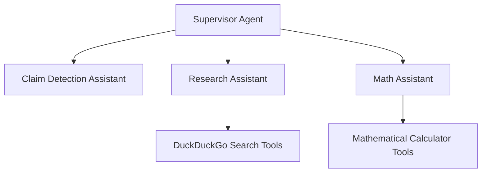

# Fact Check Assistant Lab

This lab guides you through building a multi-agent fact-checking system using AWS Strands and deploying it as a Streamlit application on AWS.

## Overview

The Fact Check Assistant is a sophisticated system that uses multiple specialized agents to detect and verify claims:

1. **Claim Detection Agent**: Identifies potentially false or misleading claims in text
2. **Research Assistant**: Performs deep fact-checking with evidence using web search
3. **Math Assistant**: Validates mathematical and statistical claims
4. **Supervisor Agent**: Orchestrates the specialized agents for comprehensive analysis

## Architecture Diagram



## Prerequisites

- AWS account with appropriate permissions
- Python 3.9+
- AWS CDK installed and configured
- Basic understanding of Python and Jupyter notebooks

## Setup Instructions

### 1. Environment Setup

Create a `.env` file in the `src/frontend` directory with the following variables:

```

LANGFUSE_PUBLIC_KEY=your_langfuse_public_key
LANGFUSE_SECRET_KEY=your_langfuse_secret_key
LANGFUSE_HOST=https://cloud.langfuse.com

```

> Note: Langfuse is used for observability. You can sign up for a free account at [langfuse.com](https://langfuse.com).

### 2. Install Dependencies

Run the following command to install the required dependencies:

```bash
pip install -r src/requirements.txt
```

### 3. Build the Agent System

Open and run the `01_setup_agent.ipynb` notebook to:

- Configure logging for Strands components
- Create the Math Assistant agent
- Create the Research Assistant agent with DuckDuckGo search capabilities
- Create the Claim Detection agent
- Create the Supervisor agent that orchestrates the specialized agents
- Test the complete multi-agent system

This notebook allows you to interactively test the fact-checking system with various queries.

### 4. Deploy to AWS

Open and run the `02_deploy_agent.ipynb` notebook to:

- Write the agent code to the frontend directory
- Test the deployed agent system
- Prepare the system for AWS deployment
- Deploy to AWS

The notebook will:

1. Write the Math Assistant to `src/frontend/math_assistant.py`
2. Write the Research Assistant to `src/frontend/research_assistant.py`
3. Write the Claim Detection Assistant to `src/frontend/claim_detection_assistant.py`
4. Write the Supervisor Agent to `src/frontend/fact_check_supervisor.py`
5. Test the complete system with a sample query
6. Deploy the CDK stack to AWS.

> Note: Deploying the CDK stack to AWS may take a up to 30 minutes to complete for the first time.

## Usage

Once deployed, you can:

1. Access the Streamlit application using the provided URL
2. Enter text containing claims you want to fact-check
3. The system will analyze the text, identify potentially false claims, and provide evidence-based verification

## Troubleshooting

- If you encounter import errors in the notebooks, ensure you've added the project root to your Python path
- For deployment issues, check your AWS credentials and permissions
- For agent errors, verify your environment variables and internet connectivity

## Clean Up

To avoid incurring charges, remember to destroy the deployed resources when you're done:

```bash
cd src/infra
cdk destroy
```
